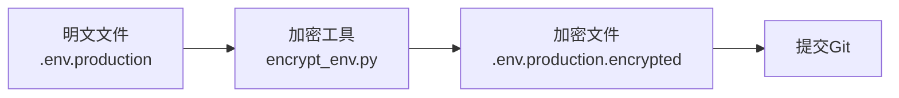
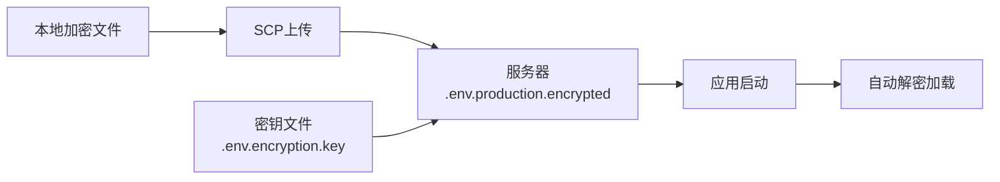
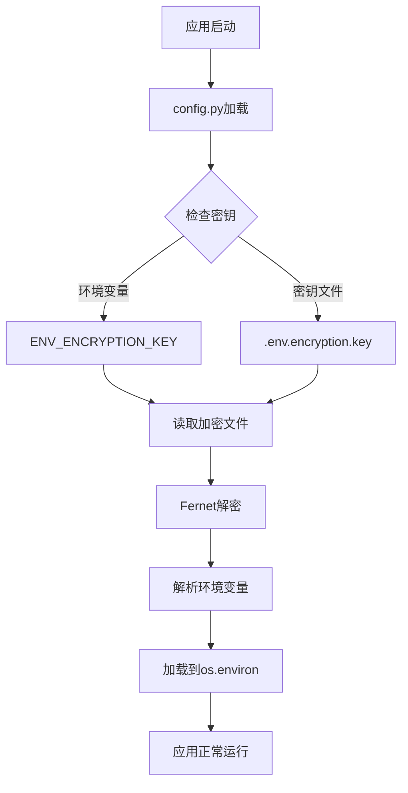

# 环境变量加密和解析技术方案

**日期**: 2025年12月23日  
**版本**: 1.0.0  
**状态**: 概要技术方案

---

## 目录

- [概述](#概述)
- [技术架构](#技术架构)
- [核心组件](#核心组件)
- [加密算法](#加密算法)
- [文件结构](#文件结构)
- [工作流程](#工作流程)
- [密钥管理](#密钥管理)
- [代码实现](#代码实现)
- [部署流程](#部署流程)
- [安全特性](#安全特性)

---

## 概述

### 问题背景

传统的 `.env` 文件包含敏感信息（API密钥、数据库密码等），如果明文存储在代码仓库中，存在以下风险：

- 代码泄露导致密钥泄露
- Git历史记录中保留敏感信息
- 协作开发时不小心提交敏感数据

### 解决方案

使用 **Fernet 对称加密算法**（基于 AES-128-CBC + HMAC）对环境变量文件进行加密：

- ✅ 加密后的文件可以安全地提交到 Git
- ✅ 加密密钥存储在系统环境变量或密钥文件中，不在代码中
- ✅ 支持多环境配置（development/production）
- ✅ 解密速度快（<10ms），对服务器启动无影响
- ✅ 内存解密，不产生临时文件

---

## 技术架构

### 架构图

```
┌─────────────────────────────────────────────────────────┐
│                    本地开发环境                          │
├─────────────────────────────────────────────────────────┤
│  1. 明文文件: .env.production                           │
│  2. 加密工具: encrypt_env.py / manage_env.py           │
│  3. 生成加密文件: .env.production.encrypted             │
│  4. 密钥管理: ENV_ENCRYPTION_KEY 或 .env.encryption.key │
└─────────────────────────────────────────────────────────┘
                        │
                        │ (SCP上传)
                        ▼
┌─────────────────────────────────────────────────────────┐
│                    生产服务器                            │
├─────────────────────────────────────────────────────────┤
│  1. 加密文件: .env.production.encrypted                  │
│  2. 密钥文件: .env.encryption.key (可选)                │
│  3. 启动时自动解密: config.py -> load_encrypted_env()   │
│  4. 加载到系统环境: os.environ                          │
└─────────────────────────────────────────────────────────┘
```

### 核心流程

1. **加密阶段**（本地）
   - 读取明文 `.env.production` 文件
   - 使用 Fernet 算法加密
   - 生成 `.env.production.encrypted` 文件

2. **部署阶段**（服务器）
   - 上传加密文件到服务器
   - 配置加密密钥（环境变量或密钥文件）

3. **运行阶段**（服务器）
   - 应用启动时自动调用 `load_encrypted_env()`
   - 读取加密文件并解密
   - 解析环境变量并加载到 `os.environ`

---

## 核心组件

### 1. 加密工具模块 (`backend/utils/env_encryption.py`)

**主要功能**:
- 生成加密密钥
- 加密环境变量文件
- 解密环境变量文件
- 解析 .env 文件内容

**核心函数**:

```python
def generate_encryption_key() -> str:
    """生成新的 Fernet 加密密钥"""
    
def encrypt_env_file(env_file: Path, encrypted_file: Path, key: str) -> None:
    """加密环境变量文件"""
    
def decrypt_env_file(encrypted_file: Path, key: str) -> str:
    """解密环境变量文件并返回内容"""
    
def parse_env_content(content: str) -> Dict[str, str]:
    """解析 .env 文件内容为字典"""
    
def load_encrypted_env(...) -> Dict[str, str]:
    """加载加密的环境变量文件到系统环境"""
```

### 2. 配置加载模块 (`backend/app/core/config.py`)

**主要功能**:
- 在模块加载时自动调用 `load_encrypted_env()`
- 从环境变量或密钥文件读取加密密钥
- 解密并加载环境变量到系统环境
- 验证关键环境变量

**关键代码**:

```python
def load_encrypted_env():
    """加载加密的环境变量文件"""
    # 1. 获取加密密钥（从环境变量或密钥文件）
    encryption_key = os.getenv('ENV_ENCRYPTION_KEY')
    if not encryption_key:
        key_file = project_root / '.env.encryption.key'
        if key_file.exists():
            encryption_key = key_file.read_text().strip()
    
    # 2. 解密加密文件
    encrypted_file = project_root / '.env.production.encrypted'
    content = decrypt_env_file(encrypted_file, encryption_key)
    env_vars = parse_env_content(content)
    
    # 3. 加载到系统环境
    for key, value in env_vars.items():
        if key not in os.environ:
            os.environ[key] = value
```

### 3. 加密脚本 (`backend/scripts/encrypt_env.py`)

**主要功能**:
- 命令行工具，用于加密环境变量文件
- 自动备份旧的加密文件
- 验证加密文件完整性

**使用方式**:

```bash
cd backend
python scripts/encrypt_env.py
```

### 4. 管理工具 (`scripts/manage_env.py`)

**主要功能**:
- 生成加密密钥
- 加密/解密环境文件
- 验证加密文件
- 导出明文备份

**使用方式**:

```bash
# 生成密钥
python scripts/manage_env.py generate-key

# 加密文件
python scripts/manage_env.py encrypt --env production

# 验证文件
python scripts/manage_env.py verify --env production

# 解密查看（调试用）
python scripts/manage_env.py decrypt --env production
```

---

## 加密算法

### Fernet 算法

**技术规格**:
- **算法**: Fernet (基于 AES-128-CBC + HMAC)
- **密钥长度**: 256 位（Base64 编码）
- **加密模式**: AES-128-CBC
- **认证**: HMAC-SHA256
- **性能**: 解密速度 < 10ms

**安全特性**:
- ✅ 防止暴力破解
- ✅ 防止篡改（HMAC 认证）
- ✅ 时间戳验证（可选）
- ✅ 高安全性

**依赖库**:
```python
from cryptography.fernet import Fernet, InvalidToken
```

---

## 文件结构

### 本地开发环境

```
backend/
├── .env.production                    # 明文环境变量文件（不提交Git）
├── .env.production.encrypted          # 加密环境变量文件（提交Git）
├── .env.encryption.key                # 加密密钥文件（不提交Git）
├── utils/
│   └── env_encryption.py              # 加密工具模块
├── app/
│   └── core/
│       └── config.py                  # 配置加载模块
└── scripts/
    └── encrypt_env.py                 # 加密脚本
```

### 生产服务器

```
/root/AuraRecruit/backend/
├── .env.production.encrypted          # 加密环境变量文件
├── .env.encryption.key                # 加密密钥文件（可选）
└── ...
```

**注意**:
- ❌ 服务器上**不存储**明文 `.env.production` 文件
- ✅ 加密文件 `.env.production.encrypted` 可以提交到 Git
- ⚠️ 密钥文件 `.env.encryption.key` **不提交**到 Git

---

## 工作流程

### 1. 本地加密流程



**步骤**:

1. 修改明文 `.env.production` 文件
2. 执行加密脚本:
   ```bash
   cd backend
   python scripts/encrypt_env.py
   ```
3. 验证加密文件:
   ```bash
   python scripts/manage_env.py verify --env production
   ```
4. 提交加密文件到 Git:
   ```bash
   git add .env.production.encrypted
   git commit -m "Update encrypted env file"
   ```

### 2. 服务器部署流程



**步骤**:

1. 上传加密文件到服务器:
   ```bash
   scp -i <key> backend/.env.production.encrypted \
       root@<server>:/root/AuraRecruit/backend/
   ```

2. 上传密钥文件（如果是新密钥）:
   ```bash
   scp -i <key> backend/.env.encryption.key \
       root@<server>:/root/AuraRecruit/backend/
   ```

3. 或者设置环境变量（服务器上）:
   ```bash
   export ENV_ENCRYPTION_KEY=$(cat .env.encryption.key)
   ```

4. 重启后端服务:
   ```bash
   bash restart_backend.sh
   ```

### 3. 运行时解密流程



**步骤**:

1. 应用启动时，`config.py` 模块被导入
2. 自动调用 `load_encrypted_env()` 函数
3. 读取加密密钥（从环境变量或密钥文件）
4. 读取并解密 `.env.production.encrypted` 文件
5. 解析环境变量并加载到 `os.environ`
6. 应用继续启动，使用解密后的环境变量

---

## 密钥管理

### 密钥获取优先级

1. **系统环境变量** `ENV_ENCRYPTION_KEY`（最高优先级）
2. **密钥文件** `.env.encryption.key`（次优先级）
3. **自动生成**（如果都不存在，仅用于开发环境）

### 密钥存储方式

#### 方式1: 系统环境变量（推荐）

**Linux/macOS**:
```bash
# 临时设置
export ENV_ENCRYPTION_KEY="your-key-here"

# 永久设置（~/.bashrc 或 ~/.zshrc）
echo 'export ENV_ENCRYPTION_KEY="your-key-here"' >> ~/.bashrc
source ~/.bashrc
```

**Windows**:
```powershell
# PowerShell
$env:ENV_ENCRYPTION_KEY="your-key-here"

# CMD
set ENV_ENCRYPTION_KEY=your-key-here
```

#### 方式2: 密钥文件

**文件位置**: `backend/.env.encryption.key`

**内容格式**:
```
your-encryption-key-here
```

**权限设置**:
```bash
chmod 600 .env.encryption.key  # 仅所有者可读写
```

### 密钥安全建议

1. ✅ **使用不同密钥**分离开发和生产环境
2. ✅ **定期轮换密钥**（建议每6个月）
3. ✅ **备份密钥**到安全的密钥管理服务
4. ✅ **限制访问权限**，只给必要的人员
5. ❌ **不要提交密钥**到 Git 仓库
6. ❌ **不要通过邮件**发送密钥
7. ❌ **不要在日志中打印**密钥

---

## 代码实现

### 加密实现

```python
from cryptography.fernet import Fernet

def encrypt_env_file(env_file: Path, encrypted_file: Path, key: str) -> None:
    """加密环境变量文件"""
    # 读取明文内容
    with open(env_file, 'rb') as f:
        plaintext = f.read()
    
    # 使用 Fernet 加密
    fernet = Fernet(key.encode('utf-8'))
    encrypted_data = fernet.encrypt(plaintext)
    
    # 保存加密文件
    with open(encrypted_file, 'wb') as f:
        f.write(encrypted_data)
```

### 解密实现

```python
def decrypt_env_file(encrypted_file: Path, key: str) -> str:
    """解密环境变量文件并返回内容"""
    # 读取加密内容
    with open(encrypted_file, 'rb') as f:
        encrypted_data = f.read()
    
    # 使用 Fernet 解密
    fernet = Fernet(key.encode('utf-8'))
    plaintext = fernet.decrypt(encrypted_data)
    
    return plaintext.decode('utf-8')
```

### 解析实现

```python
def parse_env_content(content: str) -> Dict[str, str]:
    """解析 .env 文件内容为字典"""
    env_vars = {}
    for line in content.split('\n'):
        line = line.strip()
        
        # 跳过空行和注释
        if not line or line.startswith('#'):
            continue
        
        # 解析 KEY=VALUE 格式
        if '=' in line:
            key, value = line.split('=', 1)
            key = key.strip()
            value = value.strip()
            
            # 移除引号
            if value.startswith('"') and value.endswith('"'):
                value = value[1:-1]
            elif value.startswith("'") and value.endswith("'"):
                value = value[1:-1]
            
            env_vars[key] = value
    
    return env_vars
```

### 自动加载实现

```python
# 在 config.py 模块加载时自动执行
def load_encrypted_env():
    """加载加密的环境变量文件"""
    try:
        # 1. 获取加密密钥
        encryption_key = os.getenv('ENV_ENCRYPTION_KEY')
        if not encryption_key:
            key_file = project_root / '.env.encryption.key'
            if key_file.exists():
                encryption_key = key_file.read_text().strip()
        
        # 2. 解密文件
        encrypted_file = project_root / '.env.production.encrypted'
        content = decrypt_env_file(encrypted_file, encryption_key)
        env_vars = parse_env_content(content)
        
        # 3. 加载到系统环境
        for key, value in env_vars.items():
            if key not in os.environ:
                os.environ[key] = value
        
        return True
    except Exception as e:
        logger.error(f"❌ 加密模块加载失败: {e}")
        raise

# 模块加载时自动执行
load_encrypted_env()
```

---

## 部署流程

### 完整部署步骤

#### 1. 本地准备

```bash
# 1. 修改明文环境变量文件
vim backend/.env.production

# 2. 加密文件
cd backend
python scripts/encrypt_env.py

# 3. 验证加密文件
python scripts/manage_env.py verify --env production

# 4. 提交到Git
git add .env.production.encrypted
git commit -m "Update encrypted env file"
git push
```

#### 2. 服务器部署

```bash
# 1. 上传加密文件
scp -i /path/to/key \
    backend/.env.production.encrypted \
    root@<server>:/root/AuraRecruit/backend/

# 2. 上传密钥文件（如果是新密钥）
scp -i /path/to/key \
    backend/.env.encryption.key \
    root@<server>:/root/AuraRecruit/backend/

# 3. SSH到服务器
ssh -i /path/to/key root@<server>

# 4. 设置密钥权限
chmod 600 /root/AuraRecruit/backend/.env.encryption.key

# 5. 重启后端服务
cd /root/AuraRecruit
bash restart_backend.sh
```

#### 3. 验证部署

```bash
# 查看启动日志
tail -f /root/AuraRecruit/backend/logs/app.log

# 应该看到：
# ✅ 已加载加密环境变量: .env.production.encrypted
# ✅ 共加载 XX 个环境变量
# ✅ GEMINI_API_KEY: sk-Nz1...
```

---

## 安全特性

### 1. 加密安全

- ✅ **强加密算法**: Fernet (AES-128-CBC + HMAC)
- ✅ **密钥分离**: 密钥不在代码中，存储在环境变量或密钥文件
- ✅ **防篡改**: HMAC 认证确保文件完整性
- ✅ **防暴力破解**: 256位密钥长度

### 2. 访问控制

- ✅ **文件权限**: 密钥文件权限设置为 600（仅所有者可读写）
- ✅ **环境隔离**: 开发和生产环境使用不同密钥
- ✅ **密钥备份**: 密钥备份到安全的密钥管理服务

### 3. 运行时安全

- ✅ **内存解密**: 解密在内存中进行，不产生临时文件
- ✅ **不覆盖**: 已存在的环境变量不会被覆盖
- ✅ **错误处理**: 解密失败时抛出异常，避免使用错误配置

### 4. 开发安全

- ✅ **Git安全**: 加密文件可以提交，明文文件被忽略
- ✅ **历史清理**: Git历史中不包含明文敏感信息
- ✅ **代码审查**: 没有硬编码的密钥或密码

---

## 总结

### 技术优势

1. **安全性高**: 使用成熟的 Fernet 加密算法
2. **性能优秀**: 解密速度快（<10ms），对启动无影响
3. **易于使用**: 自动加载，无需手动配置
4. **灵活部署**: 支持环境变量和密钥文件两种方式
5. **版本控制**: 加密文件可以安全地提交到 Git

### 适用场景

- ✅ 需要保护敏感环境变量的项目
- ✅ 多环境部署（开发/测试/生产）
- ✅ 需要版本控制环境配置的项目
- ✅ 团队协作开发项目

### 注意事项

1. ⚠️ **密钥安全**: 必须妥善保管加密密钥，丢失后无法解密
2. ⚠️ **密钥轮换**: 建议定期轮换密钥（每6个月）
3. ⚠️ **备份策略**: 密钥和加密文件都需要备份
4. ⚠️ **权限控制**: 限制密钥访问权限

---

**文档版本**: 1.0.0  
**最后更新**: 2025年12月23日  
**维护者**: 开发团队

